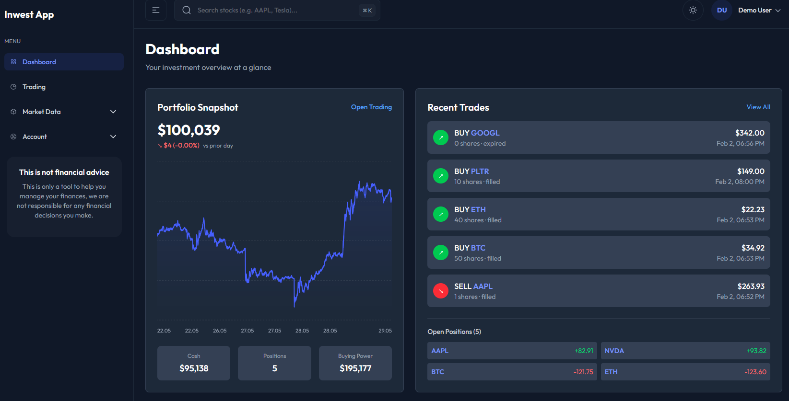
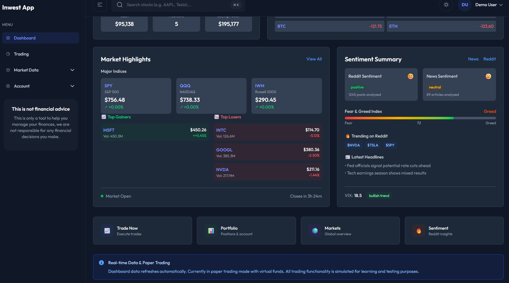
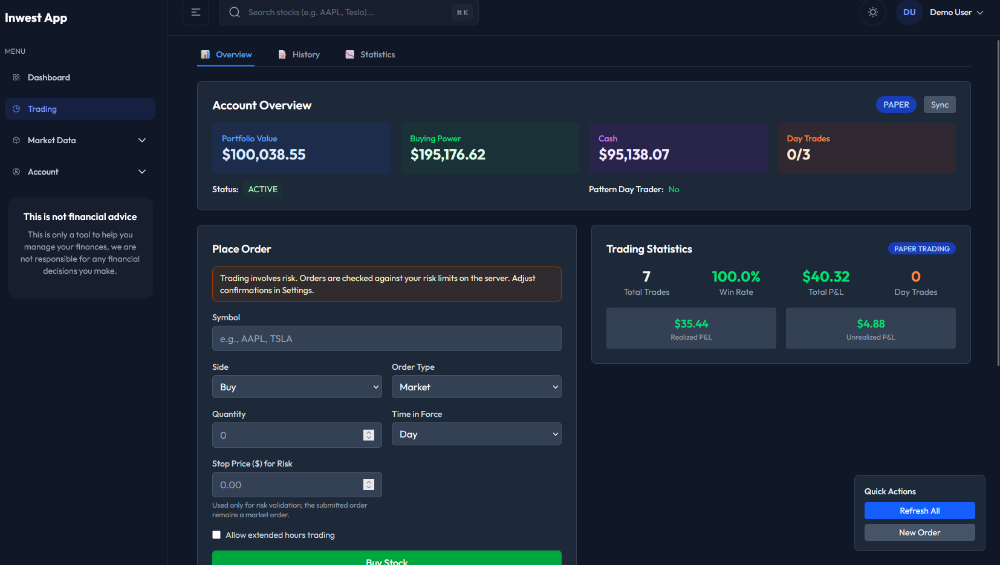
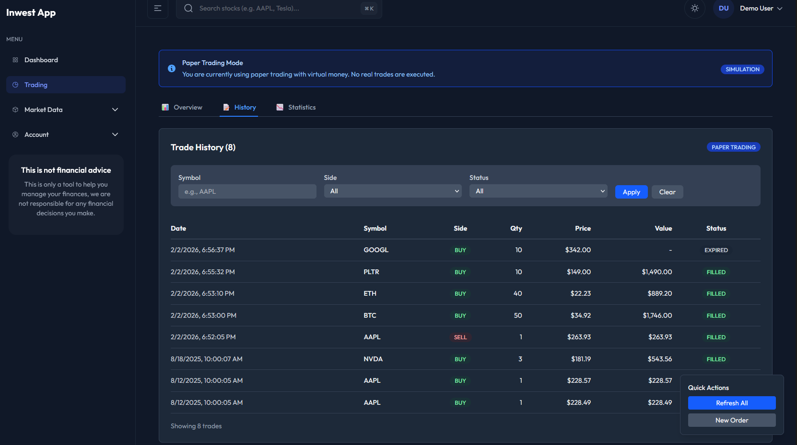
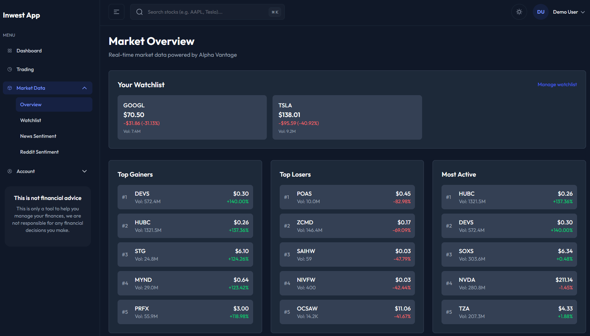
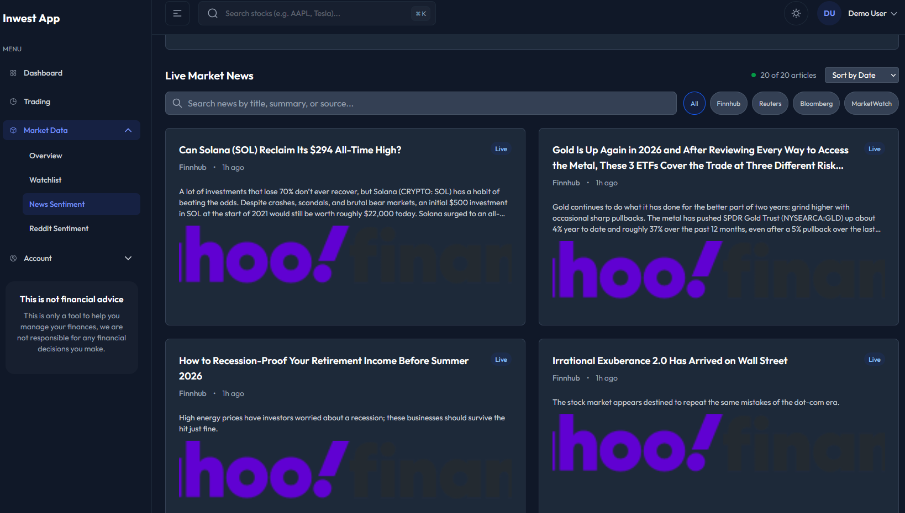
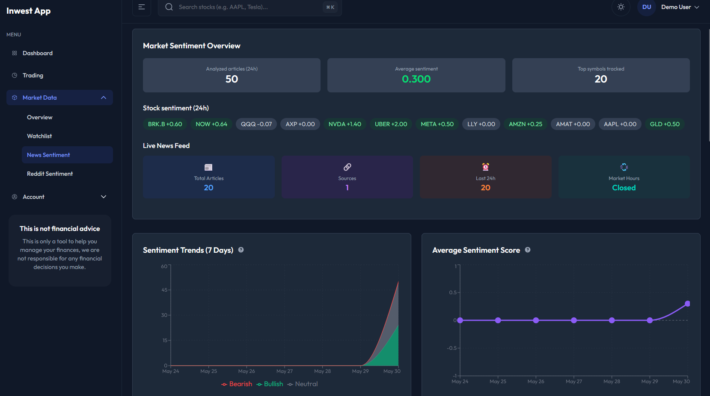
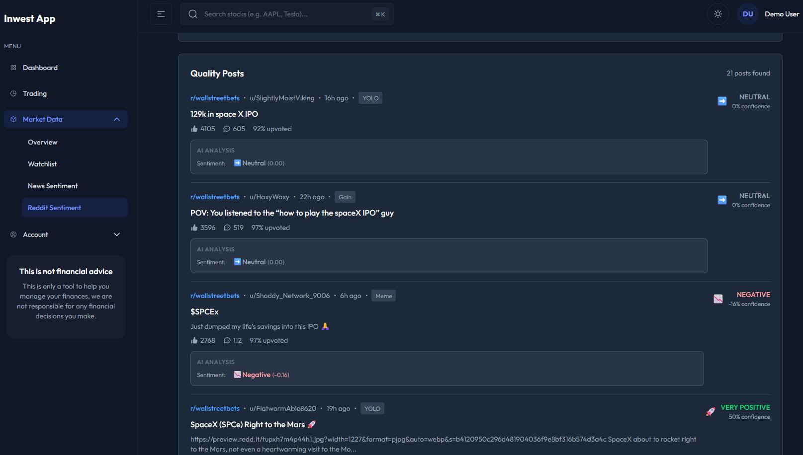
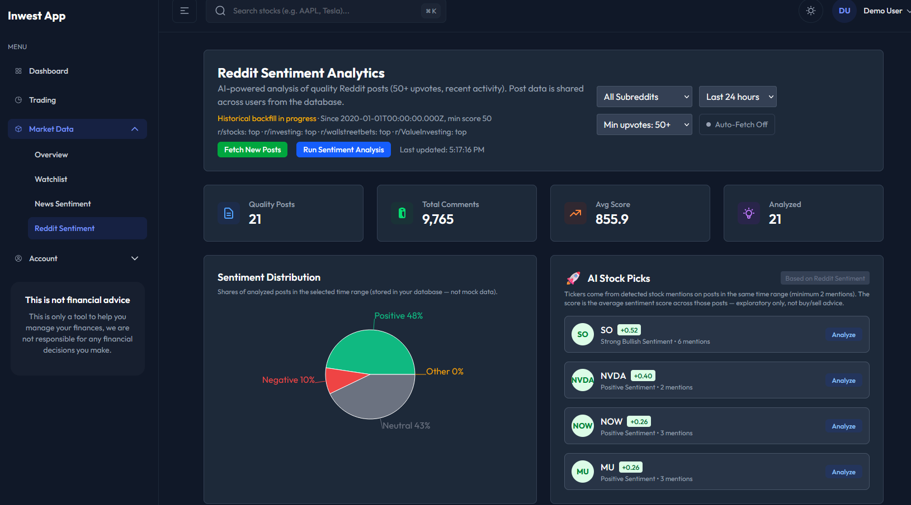
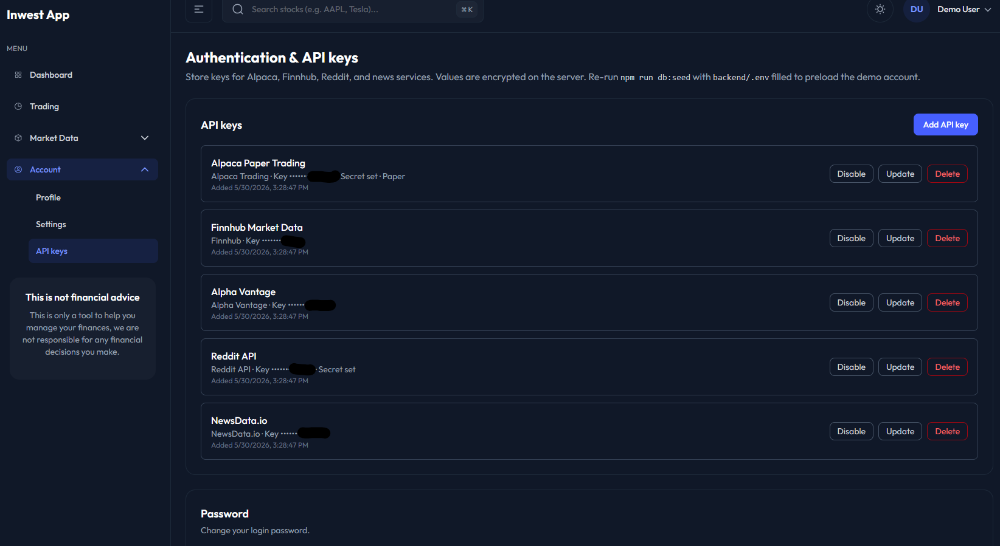

# Inwest App

Investment platform (e-business project): dashboard, **paper-only trading** (Alpaca paper API), portfolio & watchlist, JWT authentication, and optional integrations (Reddit, news, market data).

- **Paper trading only** in the current setup — no live brokerage. See [docs/INTEGRATIONS.md](docs/INTEGRATIONS.md#paper-trading-only-current-setup).
- Each user’s API keys are stored **encrypted in PostgreSQL**; new users without keys see prompts on Trading, while Reddit/News show **shared** stored data without fetch buttons. See [docs/INTEGRATIONS.md](docs/INTEGRATIONS.md#credentials-env-vs-per-user-keys).

## Screenshots

### Dashboard





### Paper trading





### Market data



### News & sentiment





### Reddit sentiment





### Account settings



## Getting started

```bash
git clone https://github.com/karolsowi/ebiz-proj.git
cd ebiz-proj
docker compose up --build
```

| | URL |
|---|-----|
| App | http://localhost:5175 |
| API / Swagger | http://localhost:3001/api/docs |
| Demo account | `demo@demo.com` / `Demo1234!` |

**Full documentation:** [docs/README.md](docs/README.md) (setup, API, architecture, integrations).

## At a glance

- `npm test` — backend tests
- `npm run docs:api` — regenerate [docs/API.md](docs/API.md)

## License

[LICENSE.md](LICENSE.md).
